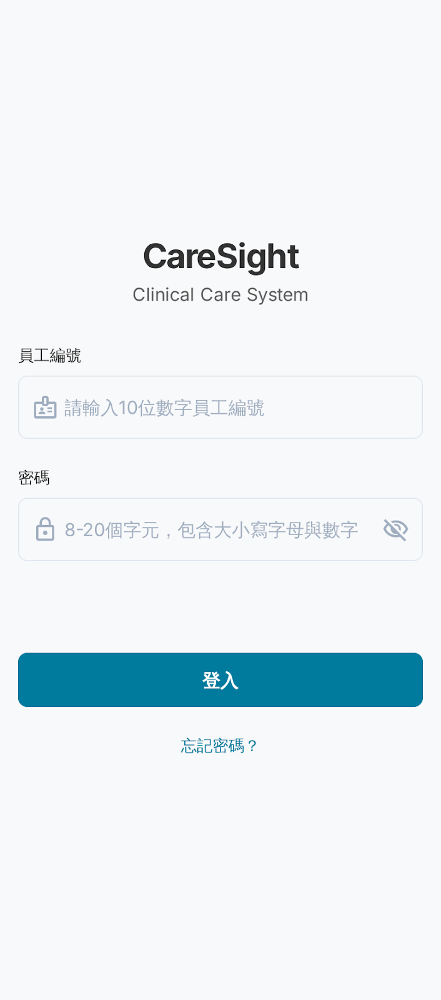
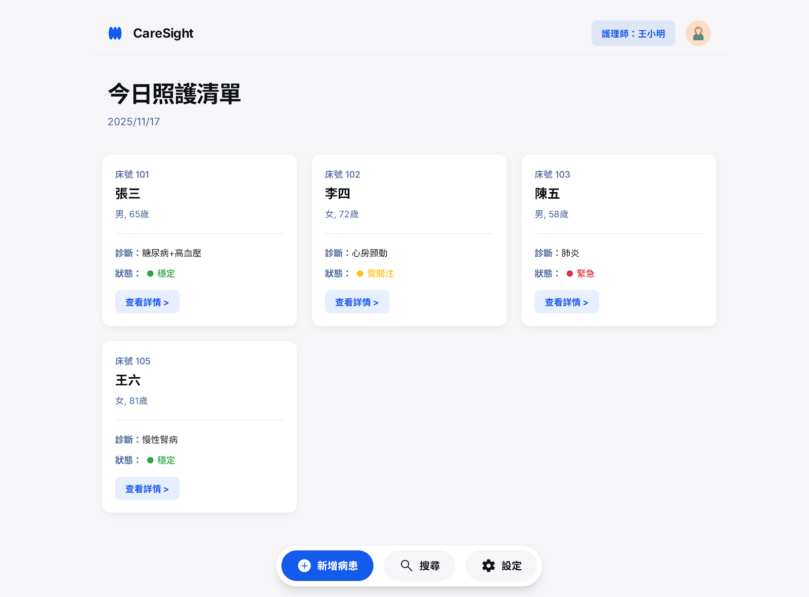
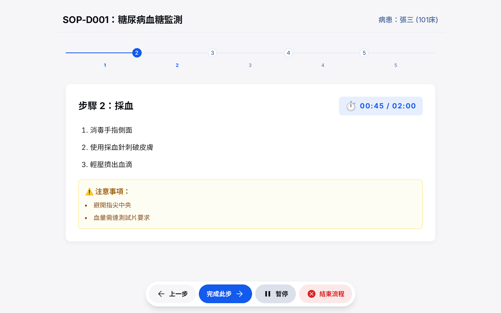
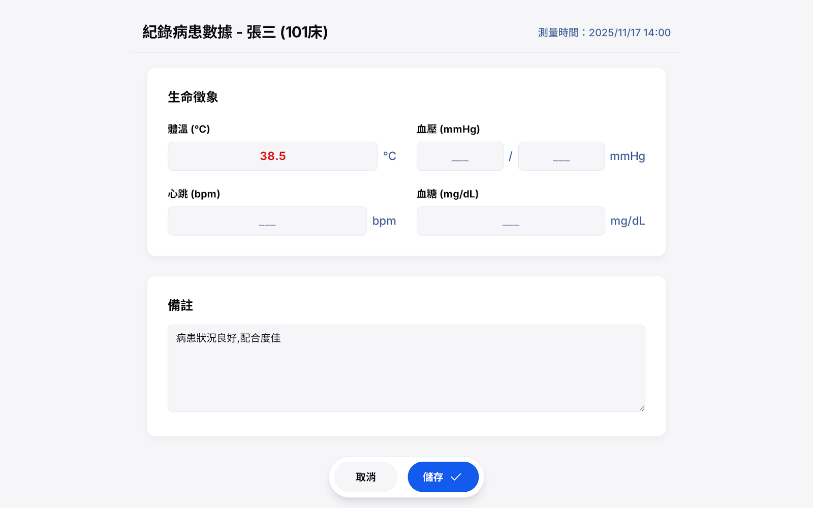
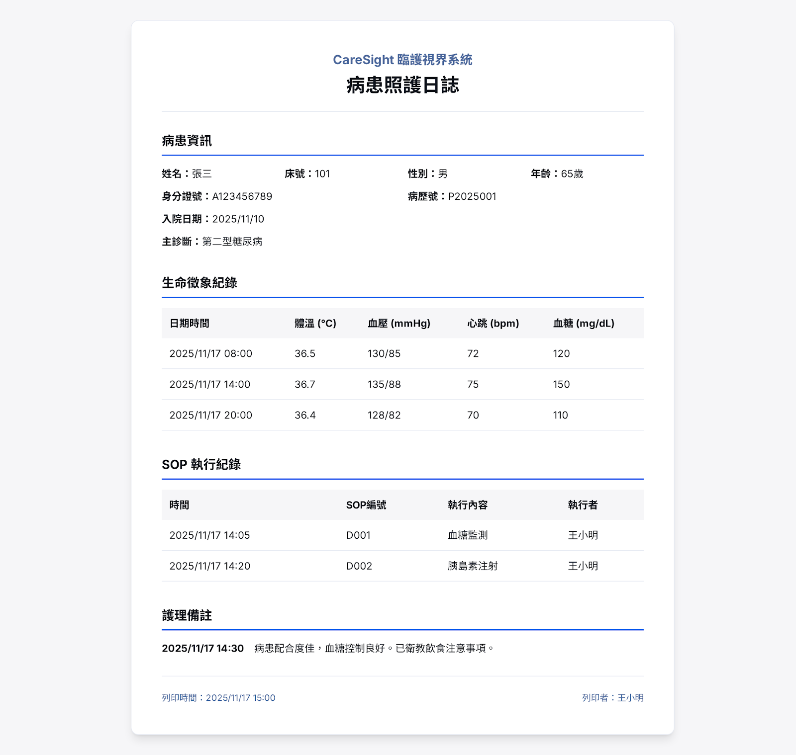
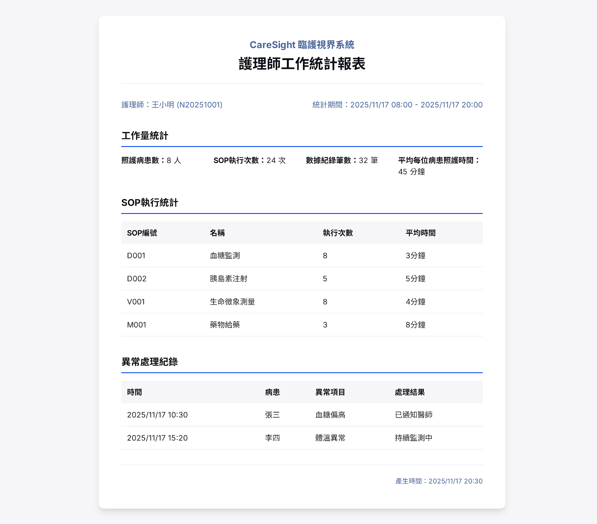

# CareSight 護理資訊系統 初始螢幕 Storyboard

---

## 1. 登入畫面

**主要功能**  
- 護理師身分認證登入系統

**輸入欄位一覽**

| 欄位名稱   | 資料型態    | 驗證規則                      |
|:---------:|:----------:|:-----------------------------|
| 員工編號   | String(10) | 僅數字、長度10碼、必填        |
| 密碼       | String(20) | 8-20字元，含大小寫及數字、必填|
| 生物辨識項 | Enum       | 指紋/臉部/語音，需註冊        |

**錯誤回報**  
- 員工編號長度或格式錯誤  
- 密碼強度不足或錯誤三次鎖定  

---

## 2. 病患清單 (今日 Dashboard)

**主要功能**  
- 展示本日照護病患一覽與狀態

**欄位一覽**

| 欄位名稱 | 資料型態 | 驗證規則    | 說明         |
|:-------:|:-------:|:-----------:|:-----------:|
| 床號     | String  | 必填        | 病床編號    |
| 姓名     | String  | 必填        | 病患姓名    |
| 性別     | Enum    | 必填        | 男/女/其他  |
| 年齡     | Integer | 0-150/必填  | 年齡        |
| 診斷     | Text    | 可選        | 主要診斷    |
| 狀態     | Enum    | 必填        | 穩定/需關注/緊急 |

---

## 3. 病患詳細資料畫面

**主要功能**  
- 單一病患完整個人、診斷與生命徵象

**欄位一覽**

| 欄位名稱   | 資料型態      | 驗證規則                 |
|:---------:|:-------------:|:------------------------|
| 姓名       | String        | 必填                    |
| 性別       | Enum          | 必填                    |
| 年齡       | Integer       | 必填、0-150             |
| 身分證號   | String(10)    | 台灣身分證格式、必填    |
| 入院日期   | Date          | 必填、YYYY/MM/DD        |
| 主診斷     | Text/ICD-10   | 必填（正規醫碼）        |
| 次診斷     | Text/ICD-10   | 可選                    |
| 過敏史     | Text          | 可選                    |
| 體溫       | Decimal(3,1)  | 30-45°C                 |
| 血壓       | Integer/Integer| 收縮50-250 舒張30-150  |
| 心跳       | Integer       | 30-200 bpm              |
| 血糖       | Integer       | 20-600 mg/dL            |

---

## 4. AI分析與SOP建議畫面

**主要功能**  
- AI自動分析病情（風險評估）  
- 顯示最佳建議SOP流程步驟與執行時間

**欄位一覽**

| 欄位名稱   | 資料型態  | 驗證規則/功能   |
|:---------:|:---------:|:---------------|
| 風險等級   | Enum      | 正常、警示、緊急|
| SOP編號    | String    | SOP標準格式    |
| 步驟編號   | Integer   | 1-N            |
| 預計時間   | Integer   | >=1分鐘        |

---

## 5. SOP流程執行畫面

**主要功能**  
- 動態逐步顯示SOP操作說明、注意事項  
- 已用時間提醒/完成進度標記

**欄位一覽**

| 欄位名稱  | 資料型態 | 說明       |
|:--------:|:--------:|:----------|
| 步驟編號  | Integer | 步驟1~N   |
| 步驟說明  | Text    | 精確指令   |
| 注意事項  | Text    | 重點安全提醒|
| 已用時間  | Time    | HH:MM:SS  |
| 標準時間  | Time    | HH:MM:SS  |

---

## 6. 數據紀錄輸入畫面

**主要功能**  
- 輸入生命徵象、備註等數據  
- 實時驗證與警示超出範圍欄位

**欄位一覽**

| 欄位名稱   | 資料型態      | 必填 | 驗證規則             |
|:---------:|:-------------:|:----:|:---------------------|
| 測量時間   | DateTime      | 是   | 不可晚於現在         |
| 體溫       | Decimal(3,1)  | 否   | 30.0-45.0            |
| 收縮壓     | Integer       | 否   | 50-250               |
| 舒張壓     | Integer       | 否   | 30-150               |
| 心跳       | Integer       | 否   | 30-200               |
| 血糖       | Integer       | 否   | 20-600               |
| 備註       | Text(500)     | 否   | ≤500字               |

---

## 報表 / 列印
### 病患照護日誌

| 欄位名稱 | 資料來源            | 功能             |
|:-------:|:-------------------:|:----------------|
| 病患資訊 | 主檔                | 列印基本資料    |
| 生命徵象 | 數據紀錄表          | 時序紀錄        |
| SOP執行紀錄 | SOP日誌表        | 完整操作記錄    |
| 護理備註 | 備註表             | 自由文字備註    |

---

### 護理師工作統計報表

| 欄位名稱      | 計算方式                     | 功能                     |
|:------------:|:----------------------------:|:------------------------|
| 照護病患數    | COUNT(DISTINCT 病患ID)       | 特定期間照護人數        |
| SOP執行次數   | COUNT(SOP執行紀錄)           | SOP總執行次數           |
| 數據紀錄筆數  | COUNT(數據紀錄)              | 共多少筆紀錄            |
| 平均照護時間  | SUM(時間)/病患數             | 每人平均照護時間        |
| 異常處理紀錄  | 報表異常欄                   | 異常警示與處理          |

---

> 可依本 Markdown 文件直接匯入 GitHub、Notion、Google Docs 或任何技術/需求規格文件，完全標註所有輸入型態驗證邏輯與報表功能一覽。
