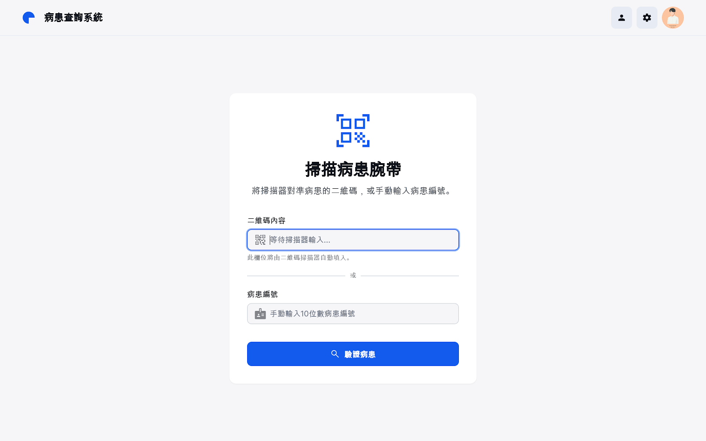
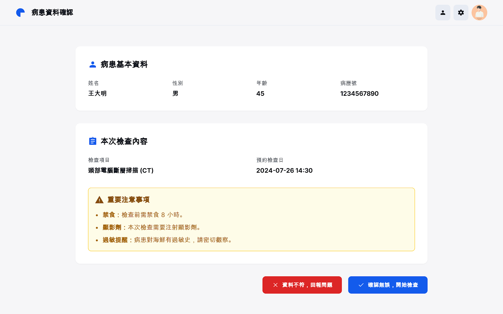
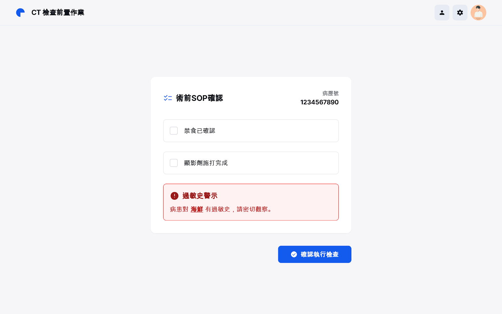
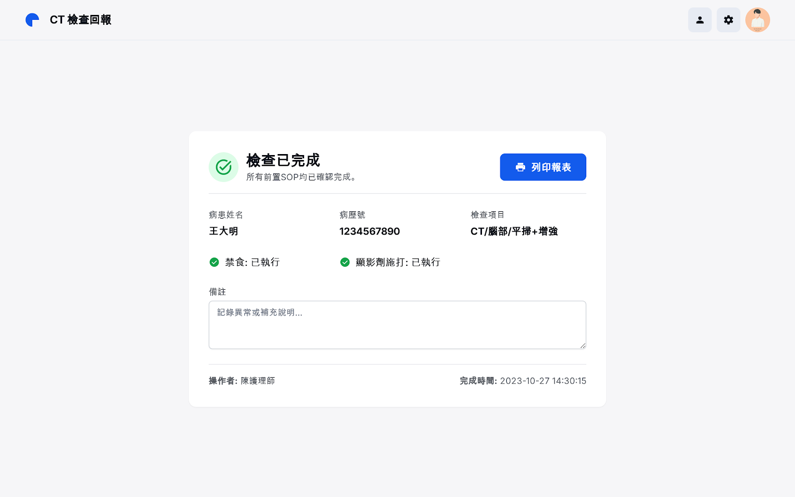

# CareSight 護理資訊系統 初始螢幕 Storyboard

---

## 1. 登入畫面

**主要功能**  
- 護理師身分認證登入系統

**輸入欄位一覽**

| 欄位名稱   | 資料型態    | 驗證規則                      |
|:---------:|:----------:|:-----------------------------|
| 員工編號   | String(10) | 僅數字、長度10碼、必填        |
| 密碼       | String(20) | 8-20字元，含大小寫及數字、必填|
| 生物辨識項 | Enum       | 指紋/臉部/語音，需註冊        |

**錯誤回報**  
- 員工編號長度或格式錯誤  
- 密碼強度不足或錯誤三次鎖定  

---

## 2. 掃描病患 QR CODE 驗證身分

**畫面功能**
- 提示用戶掃描病人手圈上的 QR CODE，或可手動輸入病患編號，以連結 CareSight 取得主檔資料。

**輸入欄位**

| 欄位名稱     | 資料型態 | 驗證規則         | 說明           |
|--------------|----------|------------------|----------------|
| QR Code內容  | String   | base64, 必填     | 醫院標準 QR code |
| 病患編號(備援)| String   | 必填, 數字,長度10 | 手動查詢備援用   |

---

## 3. 病患詳細資料畫面

**畫面功能**
- 連結 Firebase 成功後，自動顯示病患基本資料與本次應執行內容（如CT檢查、禁食、顯影劑施打等標準指引）。

**欄位一覽**

| 欄位名稱    | 資料型態 | 驗證規則    | 說明          |
|-------------|----------|------------|---------------|
| 姓名        | String   | 必填       | 病患姓名      |
| 性別        | Enum     | 必填       | 男/女/其他    |
| 年齡        | Integer  | 0-150      | 病患年齡      |
| 病歷號      | String   | 必填       | 識別ID        |
| 檢查項目    | Enum     | 必填       | CT/MRI/X光等  |
| 預約檢查日  | DateTime | 必填       | 標準格式      |
| 注意事項    | Array    | 必填       | 禁食/顯影劑/過敏提醒 |

**驗證規則**
- 所有欄位皆取自雲端主檔，同步 firebase 格式。
- 項目與注意事項比對術前清單，防誤執行。

---

## 4. AI分析與SOP建議畫面

**畫面功能**
- SOP逐步完成CT前置，含禁食、顯影劑施打、最近相關檢查狀態等互動式勾選確認。

**欄位一覽**

| 欄位名稱        | 資料型態  | 驗證規則  | 說明           |
|-----------------|-----------|----------|----------------|
| 禁食已確認      | Boolean   | 必填     | 勾選/提示      |
| 顯影劑施打完成  | Boolean   | 必填     | 勾選/提示      |
| 過敏史          | String    | 可選     | 若出現紅色高亮 |
| 確認執行檢查    | Button    | 必填     | 進入下一流程   |

---

## 5. SOP流程執行畫面

**畫面功能**
- 確認所有 CT 檢查前 SOP 均已完成，顯示檢查完成頁並支援列印報表。

**欄位一覽**

| 欄位名稱      | 來源      | 說明              |
|---------------|-----------|-------------------|
| 姓名          | 病患主檔  |                   |
| 病歷號        | 病患主檔  |                   |
| 檢查項目      | firebase  |                   |
| 禁食狀態      | 流程勾選  | 已執行/未執行     |
| 顯影劑施打    | 流程勾選  | 已執行/未執行     |
| 備註          | 使用者輸入| 異常/補充說明     |
| 操作者        | 登入人員  |                   |
| 完成時間      | 系統標記  | 檢查結束         |

